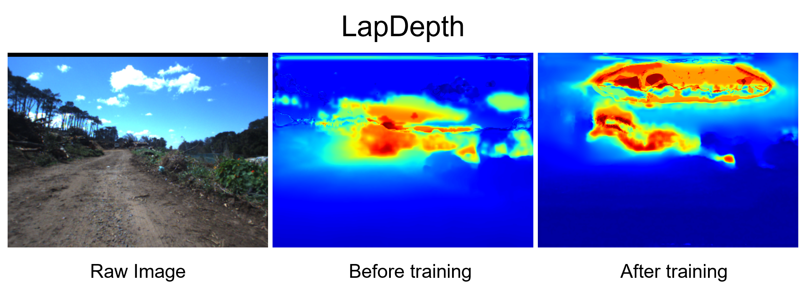
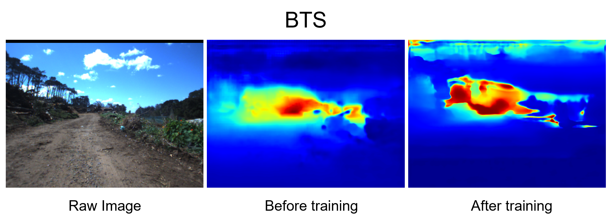

# Transfer-Learning-for-Depth-Estimation
Final year research project into the efficacy of transfer learning for depth estimation in unstructured environments

## Investigation
Three State-of-the-art depth networks were chosen and analyzed in the following phases. These depth networks were:
- [AdaBins](https://github.com/shariqfarooq123/AdaBins)
- [LapDepth](https://github.com/tjqansthd/LapDepth-release)
- [BTS](https://github.com/cogaplex-bts/bts) 

### Evaluation
The first stage of the investigation was to evaluate how well the depth networks performed on the unstructured dataset. This was done both qualitatively and quantitatively. The quantitative evaluation was done within each dataset. In order to ensure an accurate qualitative comparison, all teh output images were converted to a 'jet' style depth map. This was done using [this](https://github.com/KevinPogrund/Transfer-Learning-for-Depth-Estimation/blob/main/to_jet.py) script.

### Adaption
The networks then had to be adapted to the unstructured dataset by using transfer learning. This is the code inserted into [BTS](https://github.com/KevinPogrund/Transfer-Learning-for-Depth-Estimation/blob/main/TL_BTS.py) and [LapDepth](https://github.com/KevinPogrund/Transfer-Learning-for-Depth-Estimation/blob/main/TL_LapDepth.py). AdaBins already implements transfer learning so the only adaptions needed was to set the correct height and width, for all three depth networks.

### Re-Evaluation
These networks, no trained on the unstructured data were then evaluated and the results were compared to eachother as well as to before and after training. 

### Results
The results achieved on the three chosen networks can be seen below.

In the quantitative analysis, for a1, a2 and a3, higher is better. For everything else, lower is better

#### AdaBins
I had issues saving the trained model so there is only a quantitative analysis

 |  AdaBins  |  a1   |  a2   |  a3   | Abs Rel | Sq Rel | RMSE  | RMSE log |
   | :---: | :---: | :---: | :---: | :-----: | :----: | :---: | :------: |
   | Untrained| 0.519 | 0.793 | 0.860 |  0.273  | 6.613  | 24.833 | 0.551 |
   | Trained| 0.840 | 0.970 | 0.989 |  0.104  | 0.400  | 3.227 | 0.178 |

#### LapDepth

 |  LapDepth  |  a1   |  a2   |  a3   | Abs Rel | Sq Rel | RMSE  | RMSE log |
   | :---: | :---: | :---: | :---: | :-----: | :----: | :---: | :------: |
   | Untrained| 0.051 | 0.131 | 0.274 |  1.234  | 6.714  | 6.670 | 0.822 |
   | Trained| 0.927 | 0.982 | 0.993 |  0.083  | 0.287  | 2.289 | 0.137 |

#### BTS

 |  BTS  |  a1   |  a2   |  a3   | Abs Rel | Sq Rel | RMSE  | RMSE log |
   | :---: | :---: | :---: | :---: | :-----: | :----: | :---: | :------: |
   | Untrained|0.035| 0.070 | 0.121 |  2.007  | 18.038  | 10.583 | 1.102 |
   | Trained| 0.913 | 0.983 | 0.994 |  0.116  | 0.291  | 2.318 | 0.155 |